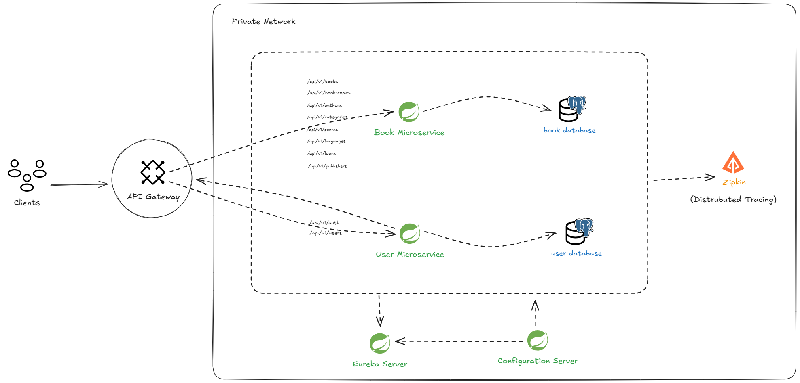
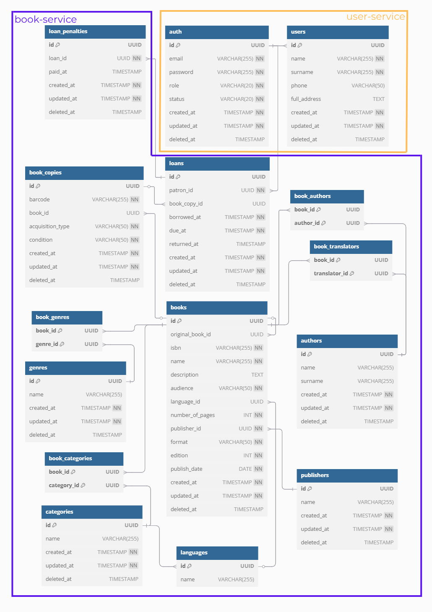

# 📚 Library Management System (Microservice Architecture)

This project is a **Spring Boot Microservice-based Library Management System** designed to manage books, users, and borrowing operations in a scalable and modular way. The system uses API Gateway, Eureka Service Discovery, Config Server, and supports JWT-based authentication and distributed tracing with Zipkin.

---

## 🧩 System Architecture



The system is composed of the following services:

- **API Gateway**: Central entry point that handles routing and filtering.
- **User Microservice**: Manages user registration, authentication, and profile updates.
- **Book Microservice**: Handles books, authors, publishers, categories, and loan operations.
- **Eureka Server**: Service discovery for microservices.
- **Config Server**: Externalized configuration management.
- **Zipkin**: For distributed tracing across services.

---

## 🗂️ Database Schema



- **User Service Tables**:
    - `auth`: Stores email, hashed password, role, and status.
    - `users`: Patron-specific data including name, phone, and address.

- **Book Service Tables**:
    - `books`, `authors`, `publishers`, `genres`, `categories`, `languages`
    - Join tables like `book_authors`, `book_genres`, `book_categories`
    - `book_copies`: Physical book copies with barcode and status
    - `loans`: Borrowed books and return tracking
    - `loan_penalties`: Tracks penalties for late returns

---

## 🔐 Authentication

The system uses **JWT-based authentication** via the `/api/v1/auth/login` and `/register` endpoints. JWTs are passed in `Authorization: Bearer <token>` headers and verified in the API Gateway.

- Roles supported:
    - `PATRON`: End users who can borrow books.
    - `LIBRARIAN`: Admin users with full access to book management.

---

## 🧪 Postman API Collection

Available in the repository as `postman_collection.json`. Main endpoints:

### 📌 Authentication

- `POST /api/v1/auth/register-librarian`
- `POST /api/v1/auth/register-patron`
- `POST /api/v1/auth/login`

### 👤 User

- `GET /api/v1/users`
- `PUT /api/v1/users/{id}`
- `DELETE /api/v1/users/{id}`

### 📖 Book Management

- `GET /api/v1/books`, `POST /books`, `PUT`, `DELETE`
- `/search` endpoint supports filters: author, genre, language, etc.

### 🧾 Book Copy

- `POST /book-copies`
- `GET /book-copies/barcode/{barcode}/available`
- `PATCH /book-copies/{id}/status`

### 🔁 Loan

- `POST /loans`
- `PATCH /loans/return/{barcode}`
- `GET /loans/my`
- `GET /loans/penalties`

---

## ⚙️ Tech Stack

- **Java 21**, Spring Boot 3+
- **Spring Cloud Gateway, Eureka, Config Server**
- **PostgreSQL**
- **JWT for Auth**
- **Lombok, WebFlux**
- **Docker & Docker Compose**
- **Zipkin for tracing**
- **Postman**
- **Swagger & OpenAPI**

---

## 🚀 How to Run (Without dockerized services)

1. **Clone the repo:**
   ```bash
   git clone https://github.com/umytyenidil/SpringLibraryManagement.git
   cd SpringLibraryManagement
   ```
2. **Run the compose:**
   ```bash
   docker compose up
   ```

3. **Run the services manually in the following order**:

   > ⚠ Make sure `PostgreSQL` is running and database connection configurations in `application.yml` are correctly set for each service.

    - **Config Server**  
      Run `ConfigServerApplication.java`

    - **Eureka Server**  
      Run `DiscoveryServerApplication.java`

    - **User Microservice**  
      Run `UserServiceApplication.java`

    - **Book Microservice**  
      Run `BookServiceApplication.java`

    - **API Gateway**  
      Run `GatewayServiceApplication.java`

4. **Access the system**:
    - Swagger UI: http://localhost:8080/swagger-ui.html
    - API Gateway: http://localhost:8080
    - Eureka Dashboard: http://localhost:8761
    - Zipkin UI (if enabled): http://localhost:9411
